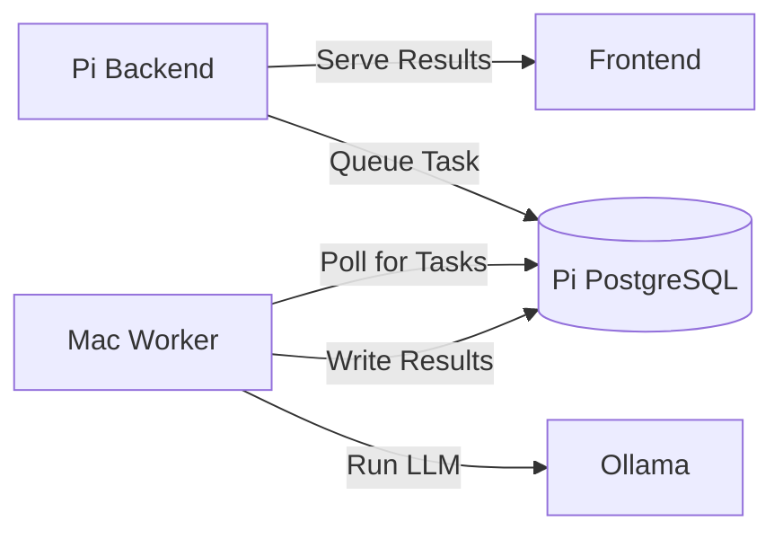

# Architecture Rationale and Design Decisions

Understanding why things are built the way they are.

---

## Overview

**Personal CRM** is designed as a single-user, local-first system optimized for personal use on constrained hardware (Raspberry Pi).

### Guiding Principles

1. **Single-user, desktop-first** — No multi-tenant complexity
2. **Local-first, cloud-optional** — Runs fully offline; internet enables AI calls & backups
3. **Opinionated minimalism** — Simplest tech that works, convention over configuration
4. **Incremental AI** — Ship rock-solid CRM first, layer AI capabilities once data is reliable
5. **Test-gate phases** — Each phase must pass tests before proceeding

---

## Layered Architecture

### Why Layered?

The backend follows a strict layered architecture to maintain separation of concerns and testability:

```
HTTP Request
    ↓
Handler (HTTP concerns, validation, status codes)
    ↓
Service (business logic, orchestration)
    ↓
Repository (data access, type conversion)
    ↓
sqlc-generated DB layer (type-safe SQL)
    ↓
PostgreSQL
```

**Benefits:**
- **Testability:** Each layer can be tested independently with mocks
- **Maintainability:** Changes in one layer don't cascade to others
- **Clarity:** Clear responsibility boundaries
- **Performance:** No hidden N+1 queries from ORMs

**Trade-offs:**
- More boilerplate than using an ORM directly from handlers
- Requires discipline to not skip layers

---

## Technology Choices

### Backend: Go

**Why Go?**
- Fast compilation and runtime
- Single static binary (easy deployment to Pi)
- Excellent concurrency primitives (goroutines for scheduler)
- Great standard library
- Low memory footprint (~10-20MB base)

**Why NOT Node.js/Python?**
- Needs runtime installed
- Higher memory usage
- GC pauses more noticeable on Pi

### Database: PostgreSQL + pgvector

**Why PostgreSQL?**
- Mature, battle-tested RDBMS
- Excellent JSON support (for flexible data)
- UUID native support
- Full-text search built-in
- pgvector extension for embeddings (single DB solution)

**Why NOT SQLite?**
- Considered, but pgvector support is immature
- Full-text search less powerful
- Wanted experience that scales to server deployment

**Why pgvector over separate vector DB?**
- Simpler deployment (one DB instead of two)
- Easier backups (single pg_dump)
- Atomic transactions across relational + vector data
- Good enough performance for single-user use

### Query Layer: sqlc (NOT an ORM)

**Why sqlc?**
- Write actual SQL (full PostgreSQL feature access)
- Compile-time type safety (catches errors before runtime)
- Zero runtime overhead (no reflection, no query building)
- Clear SQL → clear performance characteristics
- No hidden N+1 queries

**Why NOT GORM/Ent/Other ORMs?**
- ORMs abstract away SQL, making optimization harder
- Runtime overhead from reflection
- Magic behavior can hide performance issues
- sqlc gives control without sacrificing safety

**Trade-off:**
- More verbose (write SQL manually)
- Need to run `sqlc generate` after SQL changes
- But: Know exactly what queries run, when

### Frontend: Next.js 15 + React 19

**Why Next.js?**
- Excellent DX (developer experience)
- App Router for modern React patterns
- Can do SSR, SSG, or SPA (flexible deployment)
- Great image optimization
- Built-in routing

**Why React Query (TanStack Query)?**
- Simple caching and refetching
- Loading/error states handled
- Optimistic updates
- Stale-while-revalidate
- No complex state management needed

**Pi Deployment Consideration:**
- Next.js SSR mode uses ~100MB RAM
- Can export static site (~5MB) with nginx
- Decision deferred until Pi deployment

### Scheduler: robfig/cron

**Why cron in-process?**
- Simple: no external scheduler needed
- Reliable: proven library
- Efficient: runs in same process as API
- Easy time acceleration for testing

**Why NOT separate cron + systemd?**
- More moving parts
- Harder to test
- Time acceleration feature requires control

---

## Key Design Decisions

### 1. Time Acceleration Feature

**Problem:** Testing reminders with real-world cadences (weekly, monthly) takes too long.

**Solution:** `accelerated.GetCurrentTime()` instead of `time.Now()`

```go
// Environment variables control time
TIME_ACCELERATION=1440  // 1 minute = 1 day
TIME_BASE=2024-01-01T00:00:00Z

// All code uses
now := accelerated.GetCurrentTime()
```

**Benefits:**
- Test weekly cadences in minutes
- Reproducible test scenarios
- Easy to switch environments (testing/staging/prod)

**Trade-off:**
- Must remember to NEVER use `time.Now()` directly
- Requires discipline

### 2. Soft Deletes

**Decision:** Use `deleted_at TIMESTAMPTZ` instead of hard deletes.

**Rationale:**
- Recover from accidental deletions
- Maintain referential integrity for analytics
- Audit trail

**Implementation:**
```sql
deleted_at TIMESTAMPTZ  -- NULL = not deleted

-- All queries filter
WHERE deleted_at IS NULL
```

**Trade-off:**
- Need to remember to filter in all queries
- Database grows (but negligible for single user)

### 3. UUID Primary Keys

**Decision:** Use UUIDs instead of auto-incrementing integers.

**Rationale:**
- No sequential ID enumeration (privacy)
- Client-side generation possible (offline-first)
- Easier data merging/syncing
- Industry standard for distributed systems

**Trade-off:**
- Slightly larger (16 bytes vs 4-8 bytes)
- Not human-readable
- But: negligible for single-user scale

### 4. Repository Pattern with Type Conversion

**Problem:** sqlc generates types with `pgtype.Text`, `pgtype.UUID`, etc. These are verbose to work with.

**Solution:** Repository layer converts to clean domain types.

```go
// sqlc generates this
type DbContact struct {
    ID    pgtype.UUID
    Email pgtype.Text  // nullable
}

// Repository converts to this
type Contact struct {
    ID    uuid.UUID
    Email *string  // nullable
}
```

**Benefits:**
- Cleaner code in services/handlers
- Hide database-specific types
- Easier testing (no pgtype in mocks)

**Trade-off:**
- Boilerplate conversion functions
- But: centralized in repository, reusable

### 5. Fork-First Contribution Strategy

**Decision:** Build features for personal use first, contribute back later.

**Rationale:**
- Faster iteration (no PR review cycles)
- Test in real-world use before sharing
- Can make breaking changes freely
- Pi-specific features stay in fork

**How It Works:**
1. Build and test on Pi
2. Identify generic improvements
3. Create clean branch from upstream
4. Cherry-pick or reimplement
5. Submit PR

### 6. Tauri Desktop Wrapper

**Decision:** Optional Tauri app for native Mac experience.

**Rationale:**
- Native app feel (dock icon, cmd+tab)
- Manages backend lifecycle (start/stop Go binary)
- Finds free port automatically
- Better than Electron (smaller, faster)

**Trade-off:**
- Rust build toolchain required
- More complex build process
- But: optional (can use browser)

---

## Performance Optimizations for Pi

### Database Connection Pool

```go
config.MaxConns = 5                    // Pi doesn't need many
config.MinConns = 2                    // Keep 2 warm
config.MaxConnLifetime = 1 * time.Hour // Recycle connections
config.MaxConnIdleTime = 30 * time.Minute
```

**Rationale:**
- Pi has limited resources
- Single user = low concurrency
- Warm connections for responsiveness

### PostgreSQL Tuning

```sql
-- For Pi 4/5 with 4-8GB RAM
shared_buffers = 256MB
effective_cache_size = 1GB
maintenance_work_mem = 64MB
work_mem = 16MB
max_connections = 20
```

**Rationale:**
- Conservative memory usage
- Assume 2-4GB available for Postgres
- Leave room for Go backend + OS

---

## Security Model

### Single-User Assumptions

**No Authentication for Local Access:**
- Tailscale provides network-level auth
- Pi only accessible via Tailscale
- Simpler than managing auth tokens

**Future: API Key for Tailscale Access**
- Simple `X-API-Key` header
- Stored in environment variable
- Good enough for personal VPN

### Data Privacy

**Local-First Design:**
- All data on Pi (not cloud)
- LLM inference on Mac (not Pi, not cloud)
- Mac polls Pi for tasks
- Results written back to Pi

**Trade-offs:**
- LLM features only work when Mac online
- But: preserves privacy
- And: Pi stays 24/7 source of truth

---

## AI/LLM Architecture (Future)

### Hybrid Compute Model

**Problem:** Pi can't run 70B parameter LLMs.

**Solution:** Pi queues tasks, Mac processes them.



**Design:**
1. User action creates LLM task in `llm_task` table
2. Mac worker polls Pi for pending tasks
3. Worker runs Ollama (local LLM)
4. Worker writes results back to Pi
5. Pi serves results to frontend

**Benefits:**
- Pi stays always-on source of truth
- Powerful Mac only needed occasionally
- No cloud API costs (after initial embeddings)
- Privacy preserved

**Trade-offs:**
- Features only work when Mac online
- But: async design means no blocking

### Embedding Strategy

**Claude for Initial Embeddings:**
- High quality
- Fast batch API
- One-time cost for existing data

**Local Embeddings for New Data:**
- Use smaller local model (e.g., `nomic-embed-text`)
- Good enough for similarity search
- Free after setup

---

## Testing Philosophy

### Test Pyramid

```
         E2E (Playwright)
        - Full workflows
       - Slow, brittle
      - Run pre-deploy

       Integration Tests
      - DB + Repository
     - Docker required
    - Run in CI

      Unit Tests
     - Fast, isolated
    - Mock dependencies
   - Run constantly
```

**Rationale:**
- Most tests at unit level (fast feedback)
- Integration tests for critical paths
- E2E for happy path only

### Time-Accelerated Testing

Use `env.testing` for fast cadence testing:
```bash
TIME_ACCELERATION=1440  # 1 min = 1 day
# Weekly cadence = 2 minutes
# Monthly cadence = 8 minutes
```

**Benefits:**
- Test reminder generation quickly
- Reproducible scenarios
- Find timing bugs

---

## Deployment Strategy

### Development (Laptop)

```bash
make dev
# Docker Compose (PostgreSQL)
# Go backend (hot reload)
# Next.js frontend (hot reload)
```

### Production (Pi)

**Option A: Docker Compose (Current)**
```yaml
services:
  postgres:
    image: pgvector/pgvector:pg16
  backend:
    image: crm-backend:latest
  frontend:
    image: nginx:alpine  # serves static export
```

**Option B: Systemd Services (Future)**
```ini
[Unit]
Description=Personal CRM Backend

[Service]
ExecStart=/home/pi/crm-api
Restart=always
```

**Trade-offs:**
- Docker: easier, consistent
- Systemd: lighter, faster boot
- Decision: Start with Docker, optimize later

---

## Migration Strategy

### golang-migrate

**Why NOT build migration runner in code?**
- Separation of concerns
- Can run migrations independently
- Standard tool

**Why ALSO auto-run on startup?**
- Convenience in development
- Prevents "forgot to migrate" errors
- Can disable in production if desired

### Migration Principles

1. **One logical change per file**
2. **Always provide down migration**
3. **Never modify after merge**
4. **Test both up and down**
5. **Add indexes in separate migration if large**

---

## Lessons Learned (To Be Updated)

*This section will be updated as the project evolves.*

---

*For feature development process, see [`.ai/development.md`](./development.md)*

*For common code patterns, see [`.ai/patterns.md`](./patterns.md)*

*For current development rules, see [`.ai/rules.md`](./rules.md)*

*For historical context, see [`PLAN.md`](../PLAN.md) (may be outdated)*

