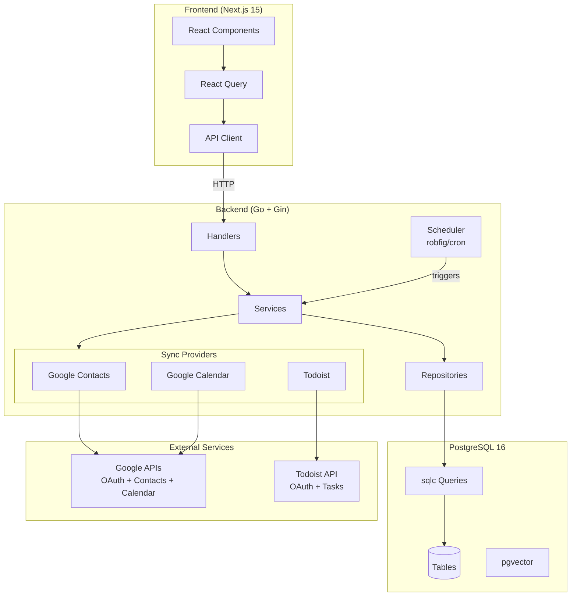

# Architecture Rationale and Design Decisions

Understanding why things are built the way they are.

---

## Overview

**Personal CRM** is designed as a single-user, local-first system optimized for personal use on constrained hardware (Raspberry Pi).

### System Architecture



### Guiding Principles

1. **Single-user, desktop-first** — No multi-tenant complexity
2. **Local-first, cloud-optional** — Runs fully offline; internet enables AI calls & backups
3. **Opinionated minimalism** — Simplest tech that works, convention over configuration
4. **Incremental AI** — Ship rock-solid CRM first, layer AI capabilities once data is reliable
5. **Test-gate phases** — Each phase must pass tests before proceeding

---

## Layered Architecture

### Why Layered?

The backend follows a strict layered architecture to maintain separation of concerns and testability:

```
HTTP Request
    ↓
Handler (HTTP concerns, validation, status codes)
    ↓
Service (business logic, orchestration)
    ↓
Repository (data access, type conversion)
    ↓
sqlc-generated DB layer (type-safe SQL)
    ↓
PostgreSQL
```

**Benefits:**
- **Testability:** Each layer can be tested independently with mocks
- **Maintainability:** Changes in one layer don't cascade to others
- **Clarity:** Clear responsibility boundaries
- **Performance:** No hidden N+1 queries from ORMs

**Trade-offs:**
- More boilerplate than using an ORM directly from handlers
- Requires discipline to not skip layers

---

## Technology Choices

### Backend: Go

**Why Go?**
- Fast compilation and runtime
- Single static binary (easy deployment to Pi)
- Excellent concurrency primitives (goroutines for scheduler)
- Great standard library
- Low memory footprint (~10-20MB base)

**Why NOT Node.js/Python?**
- Needs runtime installed
- Higher memory usage
- GC pauses more noticeable on Pi

### Database: PostgreSQL + pgvector

**Why PostgreSQL?**
- Mature, battle-tested RDBMS
- Excellent JSON support (for flexible data)
- UUID native support
- Full-text search built-in
- pgvector extension for embeddings (single DB solution)

**Why NOT SQLite?**
- Considered, but pgvector support is immature
- Full-text search less powerful
- Wanted experience that scales to server deployment

**Why pgvector over separate vector DB?**
- Simpler deployment (one DB instead of two)
- Easier backups (single pg_dump)
- Atomic transactions across relational + vector data
- Good enough performance for single-user use

**Database Tables:**

| Table | Purpose | Key Relations |
|-------|---------|---------------|
| **Core** | | |
| `contact` | People in CRM | Parent of most entities |
| `contact_method` | Email, phone, social handles | → contact |
| `note` | Freeform notes | → contact |
| `tag` | Contact categorization | ↔ contact (via contact_tag) |
| **Sync & Identity** | | |
| `external_sync_state` | Sync status per provider/account | |
| `external_sync_log` | Audit log of sync runs | → external_sync_state |
| `external_identity` | Maps external IDs to contacts | → contact |
| `external_contact` | Import candidates from Google/iCloud | → contact (optional) |
| `contact_enrichment` | Tracks field enrichment sources | → contact, external_contact |
| `oauth_credential` | OAuth tokens for Google/Todoist | |
| **Calendar** | | |
| `calendar_event` | Synced calendar events | |
| `calendar_event_attendee` | Event attendees | → calendar_event, contact |
| **Tasks** | | |
| `contact_task` | Todoist tasks linked to contacts | → contact |
| **Future/Unused** | | |
| `interaction` | Interaction logging (not yet used) | → contact |
| `connection` | Contact-to-contact relationships | → contact × 2 |
| `note_embedding` | Vector embeddings (future AI) | → note |
| `contact_summary` | AI summaries (future) | → contact |

Schema in `backend/migrations/`. Run `make sqlc` after SQL changes.

### Query Layer: sqlc (NOT an ORM)

**Why sqlc?**
- Write actual SQL (full PostgreSQL feature access)
- Compile-time type safety (catches errors before runtime)
- Zero runtime overhead (no reflection, no query building)
- Clear SQL → clear performance characteristics
- No hidden N+1 queries

**Why NOT GORM/Ent/Other ORMs?**
- ORMs abstract away SQL, making optimization harder
- Runtime overhead from reflection
- Magic behavior can hide performance issues
- sqlc gives control without sacrificing safety

**Trade-off:**
- More verbose (write SQL manually)
- Need to run `make sqlc` after SQL changes
- But: Know exactly what queries run, when

### Frontend: Next.js 15 + React 19

**Why Next.js?**
- Excellent DX (developer experience)
- App Router for modern React patterns
- Can do SSR, SSG, or SPA (flexible deployment)
- Great image optimization
- Built-in routing

**Why React Query (TanStack Query)?**
- Simple caching and refetching
- Loading/error states handled
- Optimistic updates
- Stale-while-revalidate
- No complex state management needed

**State Management via Centralized Invalidation:**
- Domain events trigger query invalidations
- Single source of truth for cross-domain effects
- See "Frontend State Management" section below

**Pi Deployment Consideration:**
- Next.js SSR mode uses ~100MB RAM
- Can export static site (~5MB) with nginx
- Decision deferred until Pi deployment

### Scheduler: robfig/cron

**Location:** `backend/internal/scheduler/scheduler.go`

**Current Jobs:**
| Job | Schedule | Description |
|-----|----------|-------------|
| External sync check | Every 5 min | Runs `syncService.RunDueSyncs()` to check for due provider syncs |

**Why cron in-process?**
- Simple: no external scheduler needed
- Reliable: proven library
- Efficient: runs in same process as API
- Easy time acceleration for testing

**Why NOT separate cron + systemd?**
- More moving parts
- Harder to test
- Time acceleration feature requires control

---

## Key Design Decisions

### 1. Time Acceleration Feature

**Problem:** Testing reminders with real-world cadences (weekly, monthly) takes too long.

**Solution:** `accelerated.GetCurrentTime()` instead of `time.Now()`

```go
// Environment variables control time
TIME_ACCELERATION=1440  // 1 minute = 1 day
TIME_BASE=2024-01-01T00:00:00Z

// All code uses
now := accelerated.GetCurrentTime()
```

**Benefits:**
- Test weekly cadences in minutes
- Reproducible test scenarios
- Easy to switch environments (testing/staging/prod)

**Trade-off:**
- Must remember to NEVER use `time.Now()` directly
- Requires discipline

### 2. Soft Deletes

**Decision:** Use `deleted_at TIMESTAMPTZ` instead of hard deletes.

**Rationale:**
- Recover from accidental deletions
- Maintain referential integrity for analytics
- Audit trail

**Implementation:**
```sql
deleted_at TIMESTAMPTZ  -- NULL = not deleted

-- All queries filter
WHERE deleted_at IS NULL
```

**Trade-off:**
- Need to remember to filter in all queries
- Database grows (but negligible for single user)

### 3. UUID Primary Keys

**Decision:** Use UUIDs instead of auto-incrementing integers.

**Rationale:**
- No sequential ID enumeration (privacy)
- Client-side generation possible (offline-first)
- Easier data merging/syncing
- Industry standard for distributed systems

**Trade-off:**
- Slightly larger (16 bytes vs 4-8 bytes)
- Not human-readable
- But: negligible for single-user scale

### 4. Repository Pattern with Type Conversion

**Problem:** sqlc generates types with `pgtype.Text`, `pgtype.UUID`, etc. These are verbose to work with.

**Solution:** Repository layer converts to clean domain types.

```go
// sqlc generates this
type DbContact struct {
    ID    pgtype.UUID
    Email pgtype.Text  // nullable
}

// Repository converts to this
type Contact struct {
    ID    uuid.UUID
    Email *string  // nullable
}
```

**Benefits:**
- Cleaner code in services/handlers
- Hide database-specific types
- Easier testing (no pgtype in mocks)

**Trade-off:**
- Boilerplate conversion functions
- But: centralized in repository, reusable

### 5. Fork-First Contribution Strategy

**Decision:** Build features for personal use first, contribute back later.

**Rationale:**
- Faster iteration (no PR review cycles)
- Test in real-world use before sharing
- Can make breaking changes freely
- Pi-specific features stay in fork

**How It Works:**
1. Build and test on Pi
2. Identify generic improvements
3. Create clean branch from upstream
4. Cherry-pick or reimplement
5. Submit PR

### 6. Persisted contact_by for Overdue Calculation

**Problem:** Computing overdue contacts on-the-fly requires loading all contacts and filtering in memory, which doesn't scale and makes database-level sorting/filtering impossible.

**Solution:** Store `contact_by DATE` on the contact record.

**How it works:**
- `contact_by` = next date by which contact should be reached
- Calculated as `last_contacted + cadence_days` (or `created_at + cadence_days` for new contacts)
- Updated automatically on: create, update cadence, mark as contacted
- Overdue query: `WHERE contact_by < today`

**Why DATE not TIMESTAMP?**
- Cadences are day-based (weekly=7 days, monthly=30 days)
- Date-only comparison is simpler and timezone-safe
- Exception: Testing mode uses in-memory timestamp comparison for accelerated cadences

**UI Exposure:**
- `contact_by` is an **internal field** NOT displayed in the frontend
- Users see `last_contacted` and `cadence` instead
- Frontend receives overdue status via the overdue contacts API

**Trade-offs:**
- Must keep `contact_by` in sync on every write path
- But: Enables efficient database queries for overdue contacts

---

## Frontend State Management

### Problem: Cross-Domain Data Consistency

Some backend operations affect multiple data domains:

| Action | Backend Effect |
|--------|----------------|
| Mark contact as contacted | Updates contact AND completes auto-reminders |
| Delete contact | Soft-deletes contact AND its reminders |

If the frontend only invalidates contact queries, reminder data becomes stale.

### Solution: Centralized Invalidation Registry

Instead of scattering `queryClient.invalidateQueries()` calls across hooks, we use a centralized registry:

```
frontend/src/lib/
├── query-keys.ts         # Centralized query key definitions
└── query-invalidation.ts # Domain event → query key mapping
```

**Domain Events:**
```typescript
type DomainEvent =
  | 'contact:created'
  | 'contact:updated'
  | 'contact:deleted'
  | 'contact:touched'   // marked as contacted
  | 'reminder:created'
  | 'reminder:completed'
  | 'reminder:deleted'
```

**Invalidation Rules:**
```typescript
const invalidationRules = {
  'contact:touched': [
    contactKeys.lists(),
    contactKeys.overdue(),
    reminderKeys.all,  // Cross-domain: backend completes reminders
  ],
  'contact:deleted': [
    contactKeys.lists(),
    reminderKeys.all,  // Cross-domain: backend deletes reminders
  ],
  // ...
}
```

**Usage in Mutations:**
```typescript
onSuccess: (data) => {
  queryClient.setQueryData(contactKeys.detail(data.id), data)
  invalidateFor('contact:touched')  // Single call handles all effects
}
```

### Why This Approach?

**Considered alternatives:**

| Approach | Pros | Cons |
|----------|------|------|
| Direct invalidation in each hook | Simple | Easy to forget cross-domain effects |
| Server-Sent Events (SSE) | Real-time, server-driven | More infrastructure, Pi resource usage |
| Polling | Simple | Battery/CPU drain, not event-driven |

**Centralized registry chosen because:**
- Single source of truth for invalidation logic
- Cross-domain effects are explicit and auditable
- Easy to extend when adding new features
- No additional infrastructure (SSE/WebSocket)
- Works well with `refetchOnWindowFocus` for edge cases

**Trade-offs:**
- Slightly more indirection than direct calls
- Must keep registry in sync with backend behavior

**Full documentation:** See `docs/FRONTEND_STATE.md`

---

## Performance Optimizations for Pi

### Database Connection Pool

```go
config.MaxConns = 5                    // Pi doesn't need many
config.MinConns = 2                    // Keep 2 warm
config.MaxConnLifetime = 1 * time.Hour // Recycle connections
config.MaxConnIdleTime = 30 * time.Minute
```

**Rationale:**
- Pi has limited resources
- Single user = low concurrency
- Warm connections for responsiveness

### PostgreSQL Tuning

```sql
-- For Pi 4/5 with 4-8GB RAM
shared_buffers = 256MB
effective_cache_size = 1GB
maintenance_work_mem = 64MB
work_mem = 16MB
max_connections = 20
```

**Rationale:**
- Conservative memory usage
- Assume 2-4GB available for Postgres
- Leave room for Go backend + OS

---

## Security Model

### Single-User Assumptions

**No Authentication for Local Access:**
- Tailscale provides network-level auth
- Pi only accessible via Tailscale
- Simpler than managing auth tokens

**Future: API Key for Tailscale Access**
- Simple `X-API-Key` header
- Stored in environment variable
- Good enough for personal VPN

### Data Privacy

**Local-First Design:**
- All data on Pi (not cloud)
- LLM inference on Mac (not Pi, not cloud)
- Mac polls Pi for tasks
- Results written back to Pi

**Trade-offs:**
- LLM features only work when Mac online
- But: preserves privacy
- And: Pi stays 24/7 source of truth

---

## External Sync Architecture

### Overview

External sync connects the CRM to external data sources (Gmail, iMessage, Google Calendar, Google Contacts, etc.) to:
- Automatically update `last_contacted` when you communicate with contacts
- Track interactions across platforms
- Import contact data from external sources

### Two Sync Strategies

**Contact-Driven Sync (Gmail, iMessage, Calendar):**
- Query external sources only for known CRM contacts
- Avoids noise from spam, newsletters, unknown senders
- Sync provider passes `KnownContactID` to skip identity search

**Discovery Sync (Google Contacts, iCloud Contacts):**
- Fetch all data from external source
- Use identity matching to find CRM contact matches
- Surface unmatched entries for manual review/import

### Identity Matching System

Connects external identifiers (emails, phones, handles) to CRM contacts:

```
External Identifier → Normalize → Search/Cache → Match Result
     │                    │            │              │
     │                    │            │              └─ ContactID (or nil)
     │                    │            └─ external_identity table
     │                    └─ E.164 phones, lowercase emails
     └─ "John Doe <john@example.com>"
```

**Key Design Decisions:**

1. **Normalization first:** All identifiers normalized before matching (E.164 for phones, lowercase for emails)

2. **Cache in database:** `external_identity` table caches matches for O(1) subsequent lookups

3. **Two modes:**
   - `KnownContactID` set → Skip search, just record mapping (contact-driven)
   - `KnownContactID` nil → Search `contact_method` table (discovery)

4. **Unmatched review:** Identities without matches stored for manual linking via API

**Files:**
- `backend/internal/identity/normalize.go` — Normalization logic
- `backend/internal/service/identity.go` — Matching service
- `backend/internal/repository/identity.go` — Data access
- `backend/migrations/012_external_identity.up.sql` — Schema

**Full documentation:** See `docs/IDENTITY_MATCHING.md`

### Sync Provider Interface

All sync providers implement:

```go
type SyncProvider interface {
    Name() string
    Sync(ctx context.Context, state *SyncState) (*SyncResult, error)
}
```

Providers are registered with the sync service and can be triggered via API or scheduler.

**Provider Settings Storage:**

Provider-specific settings (e.g., Todoist project_id, label_id) are stored in `external_sync_state.metadata` JSONB column, not in separate settings tables. This keeps all provider state in one place and simplifies the schema.

```go
// Settings read/write via helper functions
settings := getSettingsFromMetadata(state.Metadata)
settings.ProjectID = "12345"
syncRepo.UpdateSyncStateMetadata(ctx, accountID, providerName, settingsToMetadata(settings))
```

**Provider Registration (main.go):**

New providers require three steps in main.go:
1. Initialize provider with dependencies
2. Register with `providerRegistry.Register()`
3. Add routes to router

See Google Calendar or Todoist providers as reference implementations.

---

## Testing Philosophy

### Test Pyramid

```
         E2E (Playwright)
        - Full workflows
       - Slow, brittle
      - Run pre-push (diff-selected) and in CI (full)

       Integration Tests
      - DB + Repository
     - Postgres required
    - Run pre-push and in CI

      Unit Tests
     - Fast, isolated
    - Mock dependencies
   - Run constantly
```

**Rationale:**
- Most tests at unit level (fast feedback)
- Integration tests for critical paths
- E2E for happy path only

### Time-Accelerated Testing

Use `.env.example.testing` for fast cadence testing:
```bash
TIME_ACCELERATION=1440  # 1 min = 1 day
# Weekly cadence = 2 minutes
# Monthly cadence = 8 minutes
```

**Benefits:**
- Test reminder generation quickly
- Reproducible scenarios
- Find timing bugs

---

## Deployment Strategy

### Development (Laptop)

```bash
make dev
# Docker Compose (PostgreSQL)
# Go backend (hot reload)
# Next.js frontend (hot reload)
```

### Production (Pi)

**Systemd Services**
```ini
[Unit]
Description=Personal CRM Backend

[Service]
ExecStart=/home/pi/crm-api
Restart=always
```

---

## Migration Strategy

### golang-migrate

**Why NOT build migration runner in code?**
- Separation of concerns
- Can run migrations independently
- Standard tool

**Why ALSO auto-run on startup?**
- Convenience in development
- Prevents "forgot to migrate" errors
- Can disable in production if desired

### Migration Principles

1. **One logical change per file**
2. **Always provide down migration**
3. **Never modify after merge**
4. **Test both up and down**
5. **Add indexes in separate migration if large**

---

---

*For feature development process, see [`.ai/guides/feature-development.md`](./feature-development.md)*

*For common code patterns, see [`.ai/patterns/`](../patterns/)*

*For current development rules, see [`.ai/rules/core.md`](../rules/core.md)*

*For historical context, see [`PLAN.md`](../../PLAN.md) (may be outdated)*
