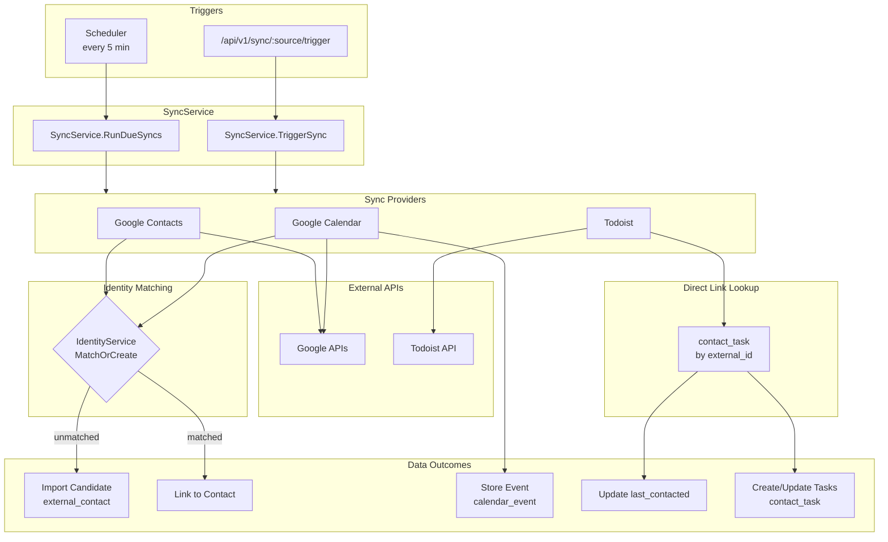

# Sync Patterns

## Registered Sync Providers

| Provider | Source Name | File |
|----------|-------------|------|
| Google Contacts | `gcontacts` | `backend/internal/google/contacts.go` |
| Google Calendar | `gcal` | `backend/internal/google/calendar.go` |
| Todoist | `todoist` | `backend/internal/todoist/provider.go` |

Providers are registered in `backend/cmd/crm-api/main.go` via `providerRegistry.Register()`.

---

## Normalize External Schemas at the Boundary

Fix external API quirks where data enters the system, not in business logic.

**Example:** Google Calendar has separate `organizer` and `attendees` fields. The organizer may not appear in attendees, but from a CRM perspective they're all "people in the meeting."

```go
// ❌ Wrong: special-casing organizer in matchAttendees()
func matchAttendees(...) {
    for _, attendee := range attendees { ... }
    // Now handle organizer separately...
}

// ✅ Right: include organizer in buildAttendeeList()
func buildAttendeeList(...) {
    attendees := // ... process event.Attendees
    // Add organizer if not already present and not self
    if !organizerInAttendees && !organizerIsSelf {
        attendees = append(attendees, organizer)
    }
    return attendees
}
```

**Why:** Business logic (`matchAttendees`) stays simple and unaware of external schema quirks. Single place to handle normalization, easier to test.

## Sync Pipeline Architecture

The sync pipeline embeds matching and enrichment as synchronous steps within the provider:

```
RunDueSyncs() / TriggerSync()
  └─ performSync()
       └─ provider.Sync() (e.g., Google Contacts)
            ├─ Fetch from external API
            ├─ ImportMatchService.FindBestMatch()  ← synchronous
            └─ EnrichmentService.EnrichContact()   ← synchronous
```

**Key insight:** Matching and enrichment are NOT separate background jobs. They run inline during the sync. The entire pipeline is tracked as a single `syncing` state in `external_sync_state`.

### Sync Data Flow Diagram



## Aggregate Sync Status for UI

When displaying sync status across multiple sources (gcal, gcontacts), use this precedence:

1. If ANY source has `status === 'syncing'` → show **syncing**
2. Else if ANY source has `status === 'error'` → show **error**
3. Else → show **synced**

```typescript
function getAggregateSyncStatus(states: SyncState[]): 'synced' | 'syncing' | 'error' {
  if (states.some(s => s.status === 'syncing')) return 'syncing'
  if (states.some(s => s.status === 'error')) return 'error'
  return 'synced'
}
```

This ensures active operations are visible first, then errors, then normal state.

## Adding Sync Status for a New Provider

Displaying sync status in settings requires two pieces:

1. **Backend:** A `SyncProvider` registered with `providerRegistry` using a consistent source name (e.g., `todoist`)
2. **Frontend:** A `SyncBadge` component that fetches sync state and triggers syncs via the API

The source name must match exactly between the UI code (`useSyncStates`, `triggerSync`) and the backend provider registration. If the UI is added before the provider exists, disable the sync button to avoid "provider not found" errors.

```typescript
// Frontend: SyncBadge for a provider
<SyncBadge
  label="Tasks"
  syncState={getSyncStateForAccount(syncStates, 'todoist', accountId)}
  onSync={() => handleSync('todoist', accountId)}
  loading={isSyncing}
/>
```

```go
// Backend: Register the provider
registry.Register(todoistProvider) // provider.Config().Name must be "todoist"
```
