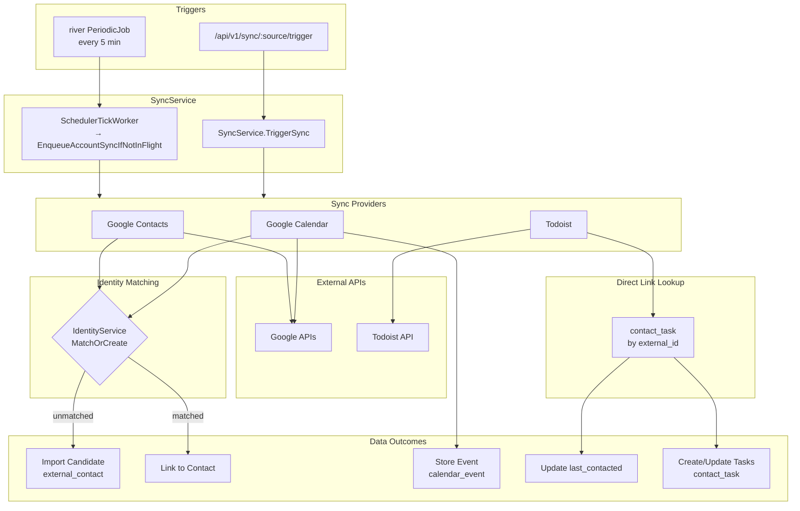

# Sync Patterns

## Registered Sync Providers

| Provider | Source Name | Strategy | File |
|----------|-------------|----------|------|
| Google Contacts | `gcontacts` | `contact_driven` | `backend/internal/google/contacts.go` |
| Google Calendar | `gcal` | `contact_driven` | `backend/internal/google/calendar.go` |
| Google Chat | `gchat` | `contact_driven` | `backend/internal/google/gchat.go` |
| Todoist | `todoist` | `fetch_all` | `backend/internal/todoist/provider.go` |
| Messages | `messages` | `push` | `backend/internal/messages/provider.go` |
| iCloud Contacts | `icloud_contacts` | `push` | `backend/internal/icloudcontacts/provider.go` |
| Phone & FaceTime | `phone_calls` | `push` | `backend/internal/phonecalls/provider.go` |

The poll-strategy providers register themselves in
`backend/cmd/crm-api/main.go` via `providerRegistry.Register()`. The three
**push** providers register through one helper,
`push.RegisterPushProviders(providerRegistry)`
(`backend/internal/push/push.go`), which main.go calls once.

**Google Chat is registered but enablement-gated.** `gchat` registers
unconditionally whenever Google OAuth is configured (it is store-only +
event-free, so unlike Gmail it does NOT gate on the event bus), but it stays
inert until `SyncService.ReconcileGChatSyncStates`
(`backend/internal/service/gchat_reconcile.go`) creates an enabled
`external_sync_state(source='gchat')` row. That reconciliation only enables an
account whose stored requested-scope list contains ALL THREE chat scopes
(`chat.spaces.readonly`, `chat.messages.readonly`, `chat.memberships.readonly`),
so the feature does no work until the operator re-consents — see
`.ai/spec/2026-06-04-gchat-integration-design.md` §7.

**Not every push source has a provider stub.** The `anarlog_humans` and
`anarlog_sessions` push sources are accepted by the ingest pipeline but
have NO `SyncProvider` registration by design — they are not poll-able and
the scheduler never needs a push-strategy entry to skip for them. So the
ProviderRegistry covers exactly three of the five push sources. The
daemonFamily descriptor's `providerStubSources` field encodes which
sources MUST have a stub; the agreement test cross-checks it against the
registry built by `push.RegisterPushProviders`.

### Sync Strategies

| Strategy | Polled by scheduler? | Cursor commits | Used by |
|----------|---------------------|----------------|---------|
| `contact_driven` | yes | provider.Sync writes via UpdateSyncStateSuccess | gcontacts, gcal |
| `fetch_all` | yes | same | todoist |
| `fetch_filtered` | yes | same | reserved |
| `push` | **no** (skipped by `SyncService.ListDueAccounts`) | daemon commits via `POST /api/v1/host/:id/sync/:source/cursor` | Mac daemon push providers (PRs 4+) |

Push-strategy rows live in `external_sync_state` keyed by
`(source, account_id)` where `account_id = mac_host.id`. The daemon owns
the cursor JSON shape; the Pi treats it as opaque TEXT. The three-stage
transactional CAS lives in `SyncRepository.CommitMacHostCursor`.

### Daemon Event Families (the descriptor table)

Daemon-push events (the ones submitted with host-auth, never on the
global-API-key path) are grouped into four **families**, one descriptor
per family, in `backend/internal/service/ingest_registry.go`:

| Family | Kinds | Allowed sources | Stub sources | Writes interactions |
|--------|-------|-----------------|--------------|---------------------|
| `raw_message` | `raw_message.received/.sent` | `messages` | `messages` | yes (`messages`) |
| `external_contact` | `external_contact.upserted/.deleted` | `icloud_contacts`, `anarlog_humans` | `icloud_contacts` | no |
| `meeting_note` | `meeting_note.recorded/.deleted` | `anarlog_sessions` | — (none) | yes (`anarlog_sessions`) |
| `call` | `call.received/.sent` | `phone_calls` | `phone_calls` | yes (`phone_calls`) |

The `daemonFamily` table is the single source of truth for: the host-auth
allowlist (`isHostOnlyKind` is derived — a kind is host-only iff it has a
`kindToFamily` entry), the per-family invariant verifier, the per-family
allowed envelope-source set, and the inline-dispatch routing. The
`IngestBatch` Step-2 invariant routing and Step-5 inline dispatch are
single `kindToFamily[env.Kind]` lookups.

**Adding a new push source** = add or extend a descriptor entry here, then
update the agreement test's expected literals. The pieces that live in
other packages (`events.AllKinds`/`kindPayloadTypes`,
`mac.AllowedPushSources`, the `interaction.source` SQL CHECK, the provider
stubs) are NOT driven from this table — the import graph forbids it — but
they are cross-checked against it:

- `TestDaemonFamilies_AgreeWithRegistries`
  (`backend/internal/service/ingest_registry_test.go`, `package
  service_test`) asserts the descriptor agrees set-for-set with
  `events.AllKinds`/`kindPayloadTypes`, `mac.AllowedPushSources`, the
  `repository.InteractionSource*` constants, and the registry built by
  `push.RegisterPushProviders`, plus per-family mapping pins that catch
  cross-family metadata swaps.
- `TestInteractionSourceCheck_AgreesWithDescriptorAndConstants`
  (`backend/tests/`, live-DB) parses the live `interaction_source_check`
  via `pg_get_constraintdef` and asserts it equals the
  `InteractionSource*` constants set-for-set, and that every
  interaction-writing family's `interactionSource` is in it. The CHECK is
  KEPT (not migrated to a lookup table) — it mixes daemon-push and
  Pi-internal sources, a different concern from this table.

**Grep guard:** `scripts/check-ingest-registry.sh` (wired into `make lint`
+ `make ci-test` + a CI step) fails if the `IngestBatch` body names any
event kind (constant or dotted string literal) or any per-family
predicate. Routing must go through the descriptor table; a stray
`events.KindFoo` inside `IngestBatch` is a lint failure. Handler/verifier
bodies OUTSIDE `IngestBatch` legitimately name kinds and are out of scope.

---

## Shared Message Aggregation (`messaging/aggregation`)

Per-source message staging tables (`telegram_message` today; `messages_message`,
`whatsapp_message` in later PRs) feed a single source-parametric burst/session
aggregator at `backend/internal/messaging/aggregation`. The shared engine
implements the burst → session → interaction pipeline (groupIntoBursts,
resolveSessions, time-based + explicit reply bridging, same-direction
coalescing) and depends only on interfaces — `SourceAdapter`, `MessageStore`,
`InteractionFinder`, `InteractionPromoter`, `InteractionExtender`,
`EventPublisher`.

Each source provides a thin adapter in its package that:

1. Implements `SourceAdapter` (returns the `interaction.source` constant,
   formats `source_ref`/`peer_ref` strings, builds description labels).
2. Implements `MessageStore` by wrapping its per-source staging repository
   and mapping rows into the source-neutral `aggregation.Message` struct.
   The staging-row → Message mapping MUST carry `InteractionID` through so
   cross-batch explicit reply bridging works.
3. Constructs `aggregation.Engine` via `aggregation.NewEngine(...)`. The
   `EventPublisher` argument MUST be the untyped-nil interface when no
   bus is configured — typed-nil concrete pointers (`(*events.Bus)(nil)`)
   bypass the engine's `publisher == nil` guard.

Telegram's `*telegram.AggregationEngine` is currently the only caller; it is
a thin shim around the shared engine, preserving its exported signature so
manager/handlers/rematch wiring and integration tests compile unchanged.

The `MessageStore` ordering contract requires adapters to emit rows ordered
by `SentAt ASC`; the engine sorts defensively, but adapters should keep the
`ORDER BY sent_at` idiom that the Telegram sqlc queries already use.

---

## Normalize External Schemas at the Boundary

Fix external API quirks where data enters the system, not in business logic.

**Example:** Google Calendar has separate `organizer` and `attendees` fields. The organizer may not appear in attendees, but from a CRM perspective they're all "people in the meeting."

```go
// ❌ Wrong: special-casing organizer in matchAttendees()
func matchAttendees(...) {
    for _, attendee := range attendees { ... }
    // Now handle organizer separately...
}

// ✅ Right: include organizer in buildAttendeeList()
func buildAttendeeList(...) {
    attendees := // ... process event.Attendees
    // Add organizer if not already present and not self
    if !organizerInAttendees && !organizerIsSelf {
        attendees = append(attendees, organizer)
    }
    return attendees
}
```

**Why:** Business logic (`matchAttendees`) stays simple and unaware of external schema quirks. Single place to handle normalization, easier to test.

## Sync Pipeline Architecture

The sync pipeline embeds matching and enrichment as synchronous steps within the provider. After #180 PR 3 the tick is a river periodic job and each account sync is a separate river job:

```
river periodic (scheduler_tick, every 5m)
  └─ SchedulerTickWorker.Work
       └─ service.ListDueAccounts
       └─ service.EnqueueAccountSyncIfNotInFlight → river_job (sync_provider_account)

river worker picks up sync_provider_account:
  └─ SyncProviderAccountWorker.Work
       └─ service.RunAccountSync
            └─ service.runSyncForState
                 ├─ AbandonRunningLogsForState  ← clears orphan 'running' logs
                 ├─ CreateSyncLog
                 └─ provider.Sync (e.g., Google Contacts)
                      ├─ Fetch from external API
                      ├─ ImportMatchService.FindBestMatch()  ← synchronous
                      └─ EnrichmentService.EnrichContact()   ← synchronous

TriggerSync() (HTTP handler)
  └─ If enqueuer wired: EnqueueAccountSyncIfNotInFlight (dedup-safe)
     Else: falls back to synchronous runSyncForState (tests / pre-wire boot)
```

**Key insight:** Matching and enrichment are NOT separate background jobs. They run inline inside `provider.Sync`. The outer dispatch (tick → worker → runSyncForState) is river-backed so a crashed worker is re-leased by river's `JobRescuer`.

The old `external_sync_state.status = 'syncing'` mutex is retired; river_job's own state (available/running/completed/retryable) is the source of truth for "in-flight". The `status` column + CHECK value `'syncing'` remain in the schema for down-migration safety but no Go code reads or writes them.

### Sync Data Flow Diagram



## Aggregate Sync Status for UI

When displaying sync status across multiple sources (gcal, gcontacts), use this precedence:

1. If ANY source has `status === 'syncing'` → show **syncing**
2. Else if ANY source has `status === 'error'` → show **error**
3. Else → show **synced**

```typescript
function getAggregateSyncStatus(states: SyncState[]): 'synced' | 'syncing' | 'error' {
  if (states.some(s => s.status === 'syncing')) return 'syncing'
  if (states.some(s => s.status === 'error')) return 'error'
  return 'synced'
}
```

This ensures active operations are visible first, then errors, then normal state.

## Adding Sync Status for a New Provider

Displaying sync status in settings requires two pieces:

1. **Backend:** A `SyncProvider` registered with `providerRegistry` using a consistent source name (e.g., `todoist`)
2. **Frontend:** A `SyncBadge` component that fetches sync state and triggers syncs via the API

The source name must match exactly between the UI code (`useSyncStates`, `triggerSync`) and the backend provider registration. If the UI is added before the provider exists, disable the sync button to avoid "provider not found" errors.

```typescript
// Frontend: SyncBadge for a provider
<SyncBadge
  label="Tasks"
  syncState={getSyncStateForAccount(syncStates, 'todoist', accountId)}
  onSync={() => handleSync('todoist', accountId)}
  loading={isSyncing}
/>
```

```go
// Backend: Register the provider
registry.Register(todoistProvider) // provider.Config().Name must be "todoist"
```

## Tracking Synced State for Bidirectional Sync

Poll-based sync providers only receive changes from the external service. When CRM updates a synced field, the external task won't appear in the next sync response.

**Solution:** Track synced state snapshots in metadata to detect drift.

```go
// Store what was synced
metadata[MetadataKeySyncedDeadline] = deadline // e.g., "2026-02-15"

// During reconciliation, compare current CRM state to stored snapshot
if syncedDeadline != currentDeadline {
    // Drift detected - CRM changed since last sync
}
```

**Key rule:** When processing external changes that update CRM state, also update the synced metadata:

```go
// ❌ Wrong: Only update CRM
if err := contactRepo.UpdateContactBy(ctx, contactID, newDeadline); err != nil { ... }

// ✅ Right: Update both CRM and synced metadata
if err := contactRepo.UpdateContactBy(ctx, contactID, newDeadline); err != nil { ... }
metadata[MetadataKeySyncedDeadline] = newDeadlineStr
contactTaskRepo.UpdateContactTaskMetadata(ctx, taskID, metadata)
```

Without this, reconciliation treats the external-originated change as CRM drift and triggers unnecessary operations (e.g., completing and recreating tasks).
