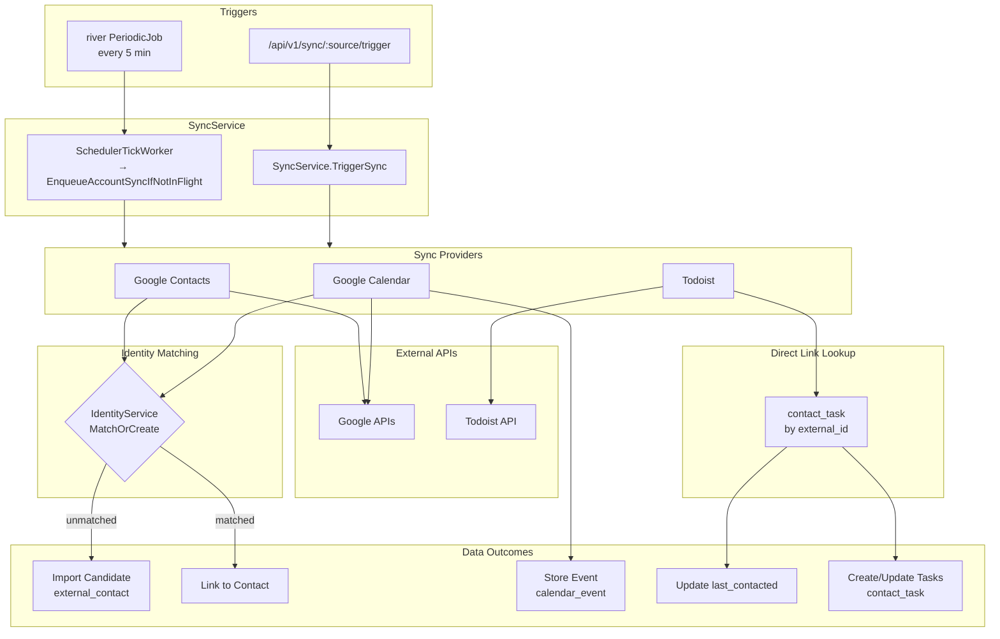

# Sync Patterns

## Registered Sync Providers

| Provider | Source Name | Strategy | File |
|----------|-------------|----------|------|
| Google Contacts | `gcontacts` | `contact_driven` | `backend/internal/google/contacts.go` |
| Google Calendar | `gcal` | `contact_driven` | `backend/internal/google/calendar.go` |
| Todoist | `todoist` | `fetch_all` | `backend/internal/todoist/provider.go` |
| Messages | `messages` | `push` | `backend/internal/messages/provider.go` |

Providers are registered in `backend/cmd/crm-api/main.go` via `providerRegistry.Register()`.

### Sync Strategies

| Strategy | Polled by scheduler? | Cursor commits | Used by |
|----------|---------------------|----------------|---------|
| `contact_driven` | yes | provider.Sync writes via UpdateSyncStateSuccess | gcontacts, gcal |
| `fetch_all` | yes | same | todoist |
| `fetch_filtered` | yes | same | reserved |
| `push` | **no** (skipped by `SyncService.ListDueAccounts`) | daemon commits via `POST /api/v1/host/:id/sync/:source/cursor` | Mac daemon push providers (PRs 4+) |

Push-strategy rows live in `external_sync_state` keyed by
`(source, account_id)` where `account_id = mac_host.id`. The daemon owns
the cursor JSON shape; the Pi treats it as opaque TEXT. The three-stage
transactional CAS lives in `SyncRepository.CommitMacHostCursor`.

---

## Shared Message Aggregation (`messaging/aggregation`)

Per-source message staging tables (`telegram_message` today; `messages_message`,
`whatsapp_message` in later PRs) feed a single source-parametric burst/session
aggregator at `backend/internal/messaging/aggregation`. The shared engine
implements the burst → session → interaction pipeline (groupIntoBursts,
resolveSessions, time-based + explicit reply bridging, same-direction
coalescing) and depends only on interfaces — `SourceAdapter`, `MessageStore`,
`InteractionFinder`, `InteractionPromoter`, `InteractionExtender`,
`EventPublisher`.

Each source provides a thin adapter in its package that:

1. Implements `SourceAdapter` (returns the `interaction.source` constant,
   formats `source_ref`/`peer_ref` strings, builds description labels).
2. Implements `MessageStore` by wrapping its per-source staging repository
   and mapping rows into the source-neutral `aggregation.Message` struct.
   The staging-row → Message mapping MUST carry `InteractionID` through so
   cross-batch explicit reply bridging works.
3. Constructs `aggregation.Engine` via `aggregation.NewEngine(...)`. The
   `EventPublisher` argument MUST be the untyped-nil interface when no
   bus is configured — typed-nil concrete pointers (`(*events.Bus)(nil)`)
   bypass the engine's `publisher == nil` guard.

Telegram's `*telegram.AggregationEngine` is currently the only caller; it is
a thin shim around the shared engine, preserving its exported signature so
manager/handlers/rematch wiring and integration tests compile unchanged.

The `MessageStore` ordering contract requires adapters to emit rows ordered
by `SentAt ASC`; the engine sorts defensively, but adapters should keep the
`ORDER BY sent_at` idiom that the Telegram sqlc queries already use.

---

## Normalize External Schemas at the Boundary

Fix external API quirks where data enters the system, not in business logic.

**Example:** Google Calendar has separate `organizer` and `attendees` fields. The organizer may not appear in attendees, but from a CRM perspective they're all "people in the meeting."

```go
// ❌ Wrong: special-casing organizer in matchAttendees()
func matchAttendees(...) {
    for _, attendee := range attendees { ... }
    // Now handle organizer separately...
}

// ✅ Right: include organizer in buildAttendeeList()
func buildAttendeeList(...) {
    attendees := // ... process event.Attendees
    // Add organizer if not already present and not self
    if !organizerInAttendees && !organizerIsSelf {
        attendees = append(attendees, organizer)
    }
    return attendees
}
```

**Why:** Business logic (`matchAttendees`) stays simple and unaware of external schema quirks. Single place to handle normalization, easier to test.

## Sync Pipeline Architecture

The sync pipeline embeds matching and enrichment as synchronous steps within the provider. After #180 PR 3 the tick is a river periodic job and each account sync is a separate river job:

```
river periodic (scheduler_tick, every 5m)
  └─ SchedulerTickWorker.Work
       └─ service.ListDueAccounts
       └─ service.EnqueueAccountSyncIfNotInFlight → river_job (sync_provider_account)

river worker picks up sync_provider_account:
  └─ SyncProviderAccountWorker.Work
       └─ service.RunAccountSync
            └─ service.runSyncForState
                 ├─ AbandonRunningLogsForState  ← clears orphan 'running' logs
                 ├─ CreateSyncLog
                 └─ provider.Sync (e.g., Google Contacts)
                      ├─ Fetch from external API
                      ├─ ImportMatchService.FindBestMatch()  ← synchronous
                      └─ EnrichmentService.EnrichContact()   ← synchronous

TriggerSync() (HTTP handler)
  └─ If enqueuer wired: EnqueueAccountSyncIfNotInFlight (dedup-safe)
     Else: falls back to synchronous runSyncForState (tests / pre-wire boot)
```

**Key insight:** Matching and enrichment are NOT separate background jobs. They run inline inside `provider.Sync`. The outer dispatch (tick → worker → runSyncForState) is river-backed so a crashed worker is re-leased by river's `JobRescuer`.

The old `external_sync_state.status = 'syncing'` mutex is retired; river_job's own state (available/running/completed/retryable) is the source of truth for "in-flight". The `status` column + CHECK value `'syncing'` remain in the schema for down-migration safety but no Go code reads or writes them.

### Sync Data Flow Diagram



## Aggregate Sync Status for UI

When displaying sync status across multiple sources (gcal, gcontacts), use this precedence:

1. If ANY source has `status === 'syncing'` → show **syncing**
2. Else if ANY source has `status === 'error'` → show **error**
3. Else → show **synced**

```typescript
function getAggregateSyncStatus(states: SyncState[]): 'synced' | 'syncing' | 'error' {
  if (states.some(s => s.status === 'syncing')) return 'syncing'
  if (states.some(s => s.status === 'error')) return 'error'
  return 'synced'
}
```

This ensures active operations are visible first, then errors, then normal state.

## Adding Sync Status for a New Provider

Displaying sync status in settings requires two pieces:

1. **Backend:** A `SyncProvider` registered with `providerRegistry` using a consistent source name (e.g., `todoist`)
2. **Frontend:** A `SyncBadge` component that fetches sync state and triggers syncs via the API

The source name must match exactly between the UI code (`useSyncStates`, `triggerSync`) and the backend provider registration. If the UI is added before the provider exists, disable the sync button to avoid "provider not found" errors.

```typescript
// Frontend: SyncBadge for a provider
<SyncBadge
  label="Tasks"
  syncState={getSyncStateForAccount(syncStates, 'todoist', accountId)}
  onSync={() => handleSync('todoist', accountId)}
  loading={isSyncing}
/>
```

```go
// Backend: Register the provider
registry.Register(todoistProvider) // provider.Config().Name must be "todoist"
```

## Tracking Synced State for Bidirectional Sync

Poll-based sync providers only receive changes from the external service. When CRM updates a synced field, the external task won't appear in the next sync response.

**Solution:** Track synced state snapshots in metadata to detect drift.

```go
// Store what was synced
metadata[MetadataKeySyncedDeadline] = deadline // e.g., "2026-02-15"

// During reconciliation, compare current CRM state to stored snapshot
if syncedDeadline != currentDeadline {
    // Drift detected - CRM changed since last sync
}
```

**Key rule:** When processing external changes that update CRM state, also update the synced metadata:

```go
// ❌ Wrong: Only update CRM
if err := contactRepo.UpdateContactBy(ctx, contactID, newDeadline); err != nil { ... }

// ✅ Right: Update both CRM and synced metadata
if err := contactRepo.UpdateContactBy(ctx, contactID, newDeadline); err != nil { ... }
metadata[MetadataKeySyncedDeadline] = newDeadlineStr
contactTaskRepo.UpdateContactTaskMetadata(ctx, taskID, metadata)
```

Without this, reconciliation treats the external-originated change as CRM drift and triggers unnecessary operations (e.g., completing and recreating tasks).
