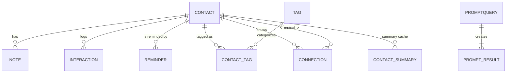

# Super-Connector CRM – Architecture & Implementation Plan

---

## 0. Guiding Principles

1. **Single-user, desktop-first** — keep everything lightweight, zero multi-tenant complexity.
2. **Local-first, cloud-optional** — runs fully on a laptop; internet enables AI calls & backups but isn’t required for core CRUD.
3. **Opinionated minimalism** — choose the simplest tech that works, bias to convention over configuration.
4. **Incremental AI** — ship rock-solid CRM first, layer AI capabilities once data is reliable.
5. **Test-gate phases** — each phase must pass its test suite before the next begins.

---

## 1. High-Level Architecture

```mermaid
graph TD
  subgraph Frontend
    A[Next.js (React) PWA] -- REST --> B[Go API]
    A -- WebSocket/SSE --> B
  end
  subgraph Backend
    B --> C[(PostgreSQL + pgvector)]
    B -- Telegram Webhook --> E(Telegram Bot)
    B -- Cron/Scheduler --> F[Reminder Engine]
  end
  B -- iCal Feed --> G[(Calendar Clients)]
  C --> H[Backup Script → Home Server]
```

Key notes:
• **Next.js** serves static assets + sleeps offline via service-worker cache.  
• **Gin (Go)** hosts REST, Cron, Telegram webhook, and RAG orchestration in one binary.  
• **PostgreSQL + pgvector** stores relational truth and embeddings.  
• **Telegram Bot** reuses the same binary (long-poll) for NL commands (no leading slash required).

---

## 2. Technology Stack

| Layer              | Choice                        | Rationale |
|--------------------|-------------------------------|-----------|
| Frontend           | Next.js + TailwindCSS         | Proven DX, SSR optional, Tailwind speed |
| State Mgmt         | TanStack Query                | Simple fetch cache, pervasive patterns |
| Graph View         | Visx + d3-force               | Lightweight, TypeScript-friendly |
| Backend Runtime    | Go 1.22 (Gin)                 | Fast, static binary, great on M-series |
| DB                 | PostgreSQL 16.x               | Mature RDBMS, rich JSONB & UUID |
| ORM / SQL Gen      | sqlc                          | Compile-time safety, zero runtime cost |
| Vector Search      | pgvector (Postgres extension) | Single DB, simpler backups & ops |
| Scheduler          | `robfig/cron`                 | Cron syntax, in-proc |
| Auth               | Bcrypt + signed cookie        | Minimal, good enough |
| Embeddings/LLM     | Claude API (Anthropic)        | High quality, supports embeddings |
| Infra              | Docker Compose                | Consistency across laptop & server |
| Backup             | `pg_dump` + `rsync`           | Nightly cron to home server |

---

## 3. Data Model

### 3.1 ER Diagram



### 3.2 PostgreSQL Schema (excerpt)

```sql
CREATE EXTENSION IF NOT EXISTS "uuid-ossp";

CREATE TABLE contact (
  id              UUID PRIMARY KEY DEFAULT uuid_generate_v4(),
  full_name       TEXT NOT NULL,
  email           TEXT,
  phone           TEXT,
  location        TEXT,
  birthday        DATE,
  how_met         TEXT,
  cadence         TEXT CHECK (cadence IN ('weekly','monthly','quarterly','biannual','annual')),
  last_contacted  DATE,
  profile_photo   TEXT,
  created_at      TIMESTAMPTZ DEFAULT NOW(),
  updated_at      TIMESTAMPTZ DEFAULT NOW()
);

CREATE TABLE tag (
  id UUID PRIMARY KEY DEFAULT uuid_generate_v4(),
  name TEXT UNIQUE NOT NULL
);

CREATE TABLE contact_tag (
  contact_id UUID REFERENCES contact(id) ON DELETE CASCADE,
  tag_id     UUID REFERENCES tag(id)     ON DELETE CASCADE,
  PRIMARY KEY (contact_id, tag_id)
);

CREATE TABLE note (
  id UUID PRIMARY KEY DEFAULT uuid_generate_v4(),
  contact_id UUID REFERENCES contact(id) ON DELETE CASCADE,
  body TEXT NOT NULL,
  category TEXT,
  created_at TIMESTAMPTZ DEFAULT NOW()
);

-- Interaction, Reminder, Connection, PromptQuery, ContactSummary tables follow similar pattern.
```

### 3.3 Embeddings (pgvector)

```sql
-- Enable extension once per database
CREATE EXTENSION IF NOT EXISTS vector;

-- Option A: store vectors alongside entities
ALTER TABLE note ADD COLUMN IF NOT EXISTS embedding vector(1536);
-- Option B: use side tables (preferred if vectors are optional/large)
CREATE TABLE IF NOT EXISTS note_embedding (
  note_id UUID PRIMARY KEY REFERENCES note(id) ON DELETE CASCADE,
  embedding vector(1536),
  created_at TIMESTAMPTZ DEFAULT NOW()
);
```

Recommended HNSW/IVFFlat indexes can be added later if needed for performance.

### 3.4 Indexes and Constraints

- contact: index on `(full_name)`, partial unique on `LOWER(email)` where `email IS NOT NULL`
- tag: unique index on `(name)`
- FKs: indexes on all foreign keys, e.g., `note(contact_id)`
- note: composite index `(contact_id, created_at DESC)`
- Optional soft-delete: add `deleted_at TIMESTAMPTZ` to `contact` (and filter in queries)

### 3.5 Time and Timezones

- Store all timestamps as `TIMESTAMPTZ` (UTC). Keep `birthday` as `DATE` and render in local tz.

---

## 4. Embedding & Retrieval Flow

1. **On note/interaction write** → enqueue job → generate Claude embedding → upsert in Postgres (pgvector).  
2. **Query** (NL prompt) → optional metadata filters → similarity search (top-k) →  
3. **Context builder** concatenates metadata + results →  
4. **Claude completion** → returns answer / suggestion.  
5. **Cache**: if `summarize <contact>` → store in `contact_summary` for quick reuse.

---

## 5. Application Directory Layout

```text
personal-crm/
├── frontend/           # Next.js app
│   ├── components/
│   ├── pages/
│   └── lib/
├── backend/
│   ├── cmd/
│   │   └── crm-api/    # main.go
│   ├── internal/
│   │   ├── db/         # sqlc-generated code
│   │   ├── reminders/
│   │   ├── rag/
│   │   ├── telegram/
│   │   └── auth/
│   └── migrations/
├── infra/
│   ├── docker-compose.yml
│   ├── backup.sh
│   └── cron/
├── tests/
│   ├── backend/
│   └── e2e/
└── docs/
    └── architecture.md (this file)
```

---

## 6. Implementation Roadmap

### Phase 1 — Core CRM (Weeks 1-3)
1. **Project scaffolding** — repo, Go module, Next.js, Docker Compose.  
2. **DB schema & migrations** (sqlc).  
3. **CRUD API** for Contact, Tag, Note, Interaction.  
4. **Frontend views**: Table + detail panel.  
5. **Reminder engine** (cron, calculation based on cadence).  
6. **To-Do dashboard**.  
7. **Telegram bot (add note, due list)**.  
8. **Tests**: unit + Playwright happy-path.

*Gate:* All CRUD tests pass; reminders generate correctly in CI.

### Phase 2 — AI Agent v0 (Weeks 4-5)
1. **Embedding pipeline** (Claude embed API, pgvector upsert).  
2. **RAG endpoint** `/ask` → Top-k search + Claude completion.  
3. **Chat UI panel** in frontend.  
4. **Contact summary cache**.  
5. **Telegram bot NL queries** (e.g., *"Who should I reach out to?"*).  
6. **Tests**: retrieval precision unit tests; latency <2s.

*Gate:* 90%+ relevant retrieval in test set; chat UI functional.

### Phase 3 — AI Agent v1 (Weeks 6-7)
1. **Intro generation** between two contacts.  
2. **Context-aware follow-up draft**.  
3. **Calendar feed (iCal) for birthdays).**  
4. **Graph view** (Visx force-graph).  
5. **Export ZIP (JSON & CSV + SQL dump).**

*Gate:* Generated intros reviewed OK; export imports cleanly.

---

## 7. Testing & QA Strategy

| Level        | Tooling                         | Coverage |
|--------------|---------------------------------|----------|
| Unit         | Go `testing`, sqlmock           | >80% back-end logic |
| API Contract | OpenAPI + codegen (oapi-codegen)| Core endpoints |
| Integration  | Docker Compose tests            | DB + API |
| Frontend/E2E | Playwright                      | Table → Detail → Add Note |
| Performance  | k6                              | `/ask` < 2s |

CI runs all suites; phase gates block merge to `main`.

---

## 8. Offline-First Notes

• **Service Worker** caches frontend assets + last 30 days of contact JSON.  
• Backend/API runs locally; if Postgres is down (no Docker), UI shows read-only cached mode.  
• If no internet: Claude calls fail gracefully; embed queue backs up for retry.

---

## 11. Security

- Cookie auth: `HttpOnly`, `Secure`, `SameSite=Lax`
- CSRF protection on mutating endpoints (cookie-based auth)
- Input sanitation on Telegram routes and global rate limiting
- First-run bootstrap for single-user setup

---

## 12. Environment Variables

- `DATABASE_URL`
- `ANTHROPIC_API_KEY`
- `SESSION_SECRET`
- `TELEGRAM_BOT_TOKEN`
- `PORT`
- `NODE_ENV`

---

## 9. Future Integrations Hooks

• Calendar sync (Google) — placeholder OAuth table.  
• Social scrape modules behind feature flags.  
• Email/IMAP ingest — separate microservice can publish to `interaction` table via REST.

---

## 10. Phase Acceptance Checklist

1. **Automated tests green**.  
2. **Manual smoke-test script executed**.  
3. **Docs updated (README, CHANGELOG).**  
4. **Backup restoration test passes**.

---

*End of plan — ready for Executor once approved.* 